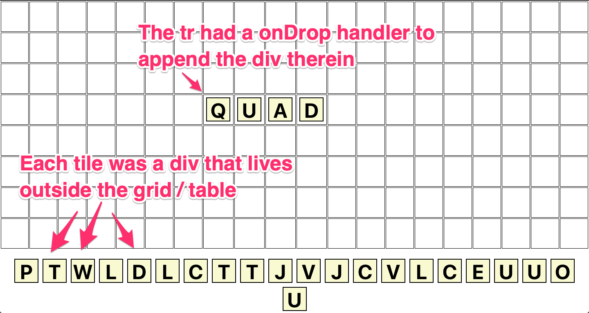
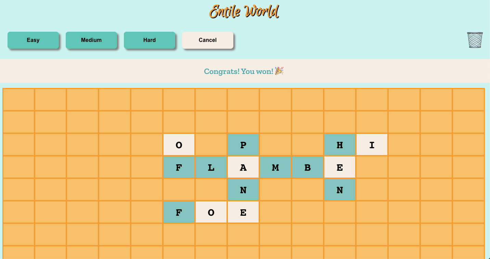

# Entile World
### Build your own board of words

To play, go to https://wordswithchung.github.io/the-entile-world/

### Versions

#### V1

#### V2

### Project notes:

* This project was bootstrapped with [Create React App](https://github.com/facebook/create-react-app).
* [Instructions](https://dev.to/yuribenjamin/how-to-deploy-react-app-in-github-pages-2a1f) used to push app to GitHub for hosting
* Site colors found on [coolors](https://coolors.co/)
* Fonts from [Google](https://fonts.google.com/)
  * [Zilla Slab](https://fonts.google.com/specimen/Zilla+Slab)
  * [Euphoria Script](https://fonts.google.com/specimen/Euphoria+Script)
* [Confetti](https://github.com/daniel-lundin/react-dom-confetti)